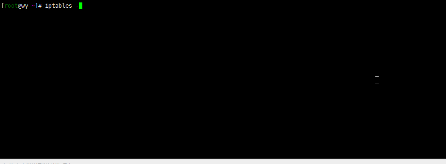
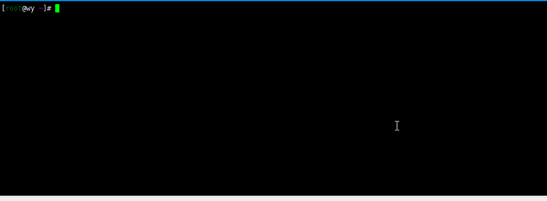
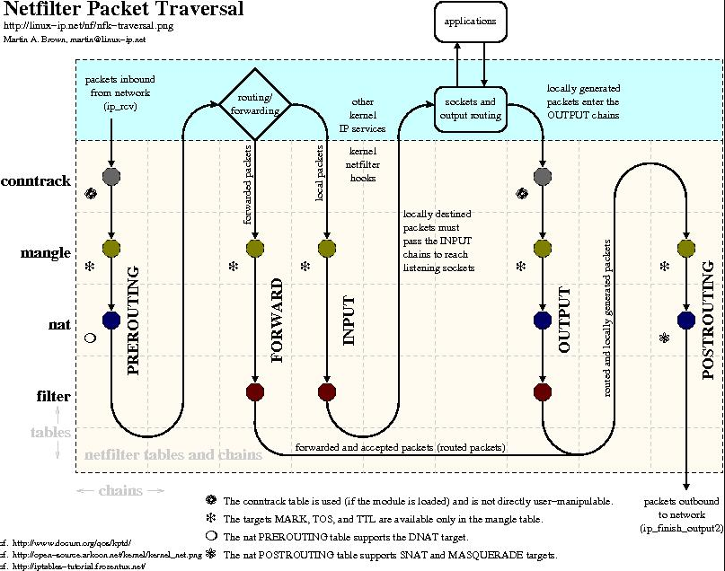

route规则和iptables规则的添加是经常使用，却也总是记不住的。我们来好好整理下。
# route
通过route指令查看当前路由规则，列表一般有Destination，Gateway，Genmask，Flags，Metric，Ref，Use Iface例如
```
Destination     Gateway         Genmask         Flags Metric Ref    Use Iface
default         gateway         0.0.0.0         UG    0      0        0 eth0
10.163.0.0      0.0.0.0         255.255.128.0   U     0      0        0 eth0
link-local      0.0.0.0         255.255.0.0     U     1002   0        0 eth0
172.17.0.0      0.0.0.0         255.255.0.0     U     0      0        0 docker0
192.168.1.11    0.0.0.0         255.255.255.255 UH    0      0        0 eth0
```
- 目的地址可以是个网络地址例如172.17.0.0，也可是个具体的ip地址如192.168.1.11.  
- 网关Gateway，如果在添加的时候没有指定gw选项则默认填充0.0.0.0或*缺省，此时会按照网卡作为下一跳。  
- mask是子网掩码，对于具体的ip地址掩码则是4个255.  
- flags有U可用正在生效，G通过网关(gateway)连接（即Gateway一栏不为0.0.0.0），H目的地址是个ip(host)而不是网络.  
- metric跳数（跃点数），经过多少个网关到达，一般不添加就是0了，多数时候不需要在意这个值  
- UseIface就是通过哪张网卡。
route add和route del是最常用的指令，分别用于添加和删除路由规则
## route add
```
-net目的网络地址 
-host目的ip地址
gw设置网关
dev设置网卡
```
设置到另一个网络的路由用-net，设置到一个具体ip的用-host，设置到达目的地址的网关用gw，设置到达目的地址的下一跳网卡用dev
```
# 指定访问网络用哪张网卡
route add -net 10.0.0.0/24 dev eth0

# 指定访问网络通过哪个网关 
route add -net 10.0.0.0/24 gw 192.168.1.1

# 指定访问ip用哪张网卡
route add -host 10.0.0.1 dev eth0

# 指定访问网络通过哪个网关 
route add -host 10.0.0.1 gw 192.168.1.1
```
默认路由
```
route add -net 0.0.0.0/0 dev eth0
route add -net 0.0.0.0/0 gw 1.1.1.1

#简略写法
route add default dev eth0
route add default gw 1.1.1.1
```
关于掩码,下列两者等价
```
route add -net 10.0.0.0/24 gw 192.168.1.1
route add -net 10.0.0.0 netmask 255.255.255.0 gw 192.168.1.1
```
## route del
用法和route add一样如
```
route del -net 10.0.0.0/24 dev eth0
route del -net 10.0.0.0/24 gw 192.168.1.1
route del -host 10.0.0.1 dev eth0
route del -host 10.0.0.1 gw 192.168.1.1
```
有些时候可以简化比如到达网络或ip的路由只有想删除的那一条就直接
```
route del -net 10.0.0.0/24
route del -host 10.0.0.1
```
# iptables
iptables可以设置本机的出入规则，所以有时候把他叫做防火墙，iptables本身是维系三个表的，mangle，nat，filter优先级依次降低，
查看当前的iptables规则
```
#查看列表-L 附带行号--line-numbers -t指定哪个表，不指定就是filter
iptables -L --line-numbers -t filter
```
分了几个大的块每个块叫做Chain（链）。比较常见的filter中的Chain为
- INPUT链：外界访问本机，数据入
- OUTPUT链：本机到外界，数据出
- PORWARD链：数据经过本机，转发到其他地方

nat表中的链择除了有INPUT，OUTPUT，PREROUTING和POSTROUTING。
- PREROUTING链：数据包收到之后直接转发到另一个地方
- POSTROUTING链：

而每个记录又有这些字段
- target规则类型ACCEPT接收，DROP丢弃，REDIRECT重定向，SNAT源地址转换，DNAT目标地址转换，等。
- prot协议如tcp udp all指所有
- opt操作参数，一般都是空
- source源地址，指的从哪个ip访问进来的，anywhere就是对所有访问源生效
- destination目的地址，指的访问哪个目的地址的时候生效

例如我们看最简单的filter规则
## 1 ip黑名单
```
Chain INPUT (policy ACCEPT)
num  target     prot opt source               destination         
1    DROP       tcp  --  10.0.0.1             anywhere             tcp dpt:ssh         
```
`policy ACCEPT`如果没有一条规则匹配则按照policy中设置的来，第一条规则配置了10.0.0.1这个ip发过来的想要连接22号端口的数据包全部丢弃。添加的指令如下
```bash
# -A等价于--append追加一条规则；-A INPUT指定了INPUT链追加
# -j指定target类型
# -p指定协议
# -s指定源地址，-d则是目的地址
# --sport指定源端口，--dport指定目的端口
iptables -A INPUT  -j DROP -p tcp --dport 22 -s 10.0.0.1
```
## 2 防火墙
将所有INPUT端口设为DROP，只有手动开启才能访问，建立端口安全的防火墙
```
# 设置已经建立连接的和在已有链接中建立新的连接的规则为accept
iptables -A INPUT -m state --state ESTABLISHED,RELATED -j ACCEPT

# -P等价于--policy，将policy设为DROP
iptables -P INPUT DROP
```
不要乱试，这可能导致ssh断开，永远失联。  
如果不加第一条，则会导致想要连接其他服务器，连接后无法收到对面发回来的响应，curl baidu.com会超时，补充上第一条后，才可以。
## 3 执行顺序问题
从第1条开始匹配，如果匹配成功则按照第一条的规则来，否则到第二条，全部不匹配则按照policy。  
因为有先后顺序而-A是追加到最后的，所以需要用-I参数插入到最前面，-I还可以指定插入到第几行
```
iptables -I input 2 -j ACCEPT
```
删除某一条规则
```
iptables -D input 2
```
然后我们来看下转发规则表nat

## 1 数据包转发
除了设置过滤规则iptables还可以设置转发规则，通过-t nat指定为转发规则，上面的过滤规则是默认参数-t filter。

设置发到本机（192.168.0.33）的80端口的数据包全都转发到1.1.1.1:80：
```
iptables -t nat -A PREROUTING -p tcp --dport 80 -j DNAT --to 1.1.1.1:80
iptables -t nat -A POSTROUTING -p tcp -d 1.1.1.1 --dport 80 -j SNAT --to 192.168.0.33
```
注意这里需要在路由生效后进行源地址的修改，第二句是将发送到1.1.1.1:80的数据包的源地址修改为192.168.0.33（本机ip），这样这个ip的数据才能正常的返回给这台机器。

上面的第二行可以简写为：
```
# MASQUERADE是用发送数据的网卡上的IP来替换源IP
iptables -t nat -A POSTROUTING -p tcp -d 1.1.1.1 --dport 80 -j MASQUERADE
```

## 2 本机端口变换
80转8080
```
iptables -t nat -A PREROUTING -p tcp --dport 80 -j REDIRECT --to-ports 8080
```


iptables下，数据包的处理流程  
