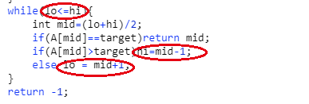
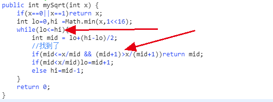
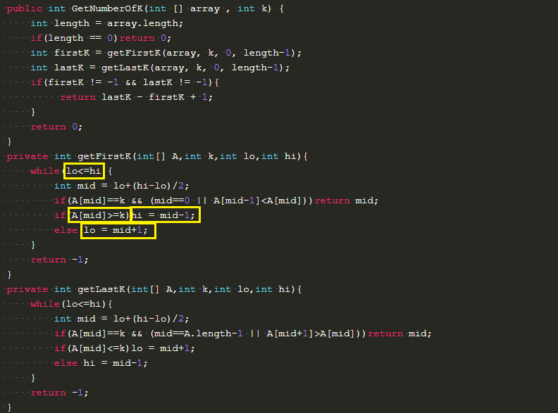
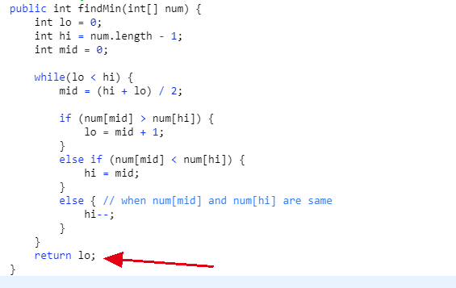

# 二分查找
二分查找是针对有序数组的非常快速的查找方式，本身的思路非常简单，不过对于有些题目，经常存在难以应对的边界问题，本文做出深入探究。首先基本的二分查找的式子如下：  
  
注意红色圈的几个点。
# 题目
> 1 实现sqrt函数，保留整数部分  
  
与二分法的形式一致，只不过判断mid是解的条件进行了简单修改。这里不要用mid*mid会越界int。

> 2 排序数组中t出现的次数。
  
本题中也是延用二分法的形式，三个点没有变化，判断mid的地方进行了修改，且后面判断中也有=的情况。

> 3 旋转数组最小值  
  
这个题中，判断条件`lo<hi`也可以写成`lo<=hi`。后面的比较是与hi比较而非lo比较。最后相等的时候hi还要--，返回的是lo。   
我们来分别解释下：首先选择最小的值，旋转数组最小值的特点是左边比他大。如果中间值比hi大，则lo=mid+1.反之不能mid-1.因为mid如果此时正好是最小的值则也满足小于hi，mid-1则将mid排除在外了，所以这里是没有-1的。其次while条件中的`<`和`<=`都可以。最后hi--是当mid和hi如果一样的时候。
