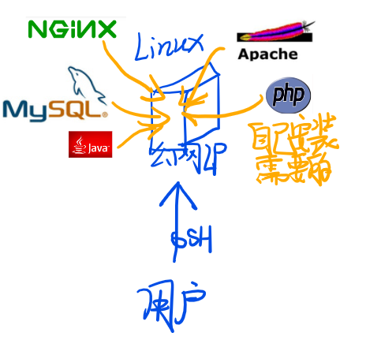
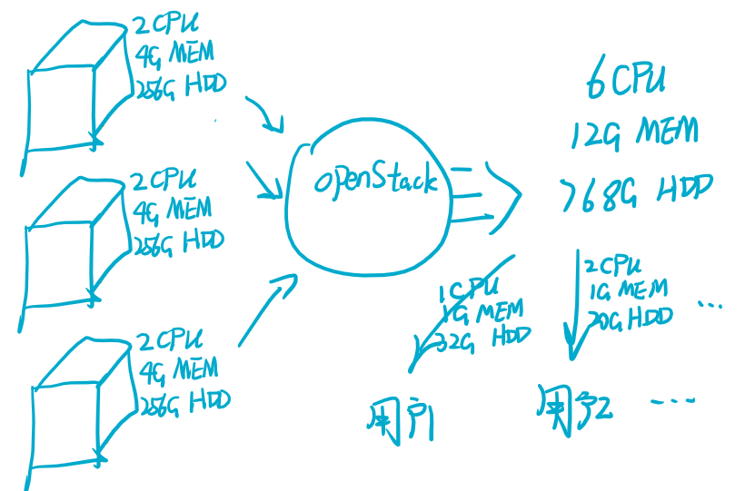
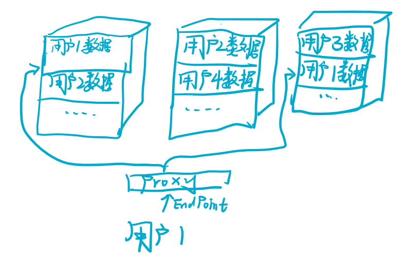
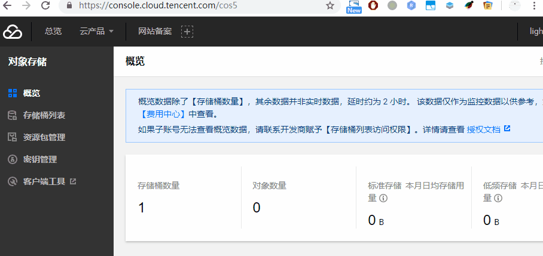
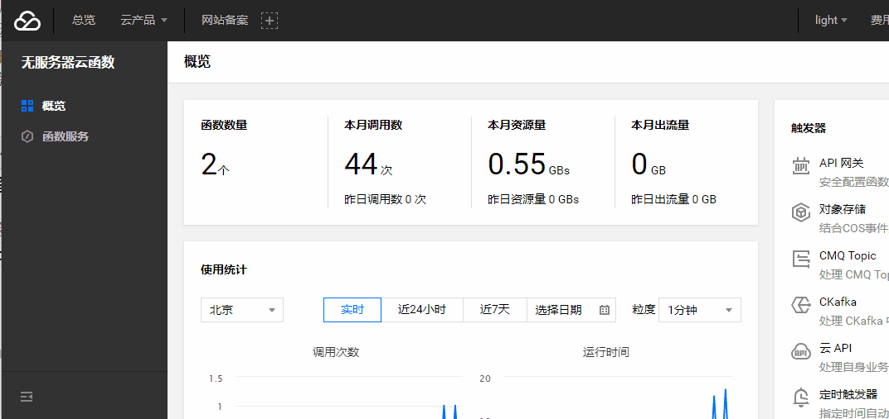
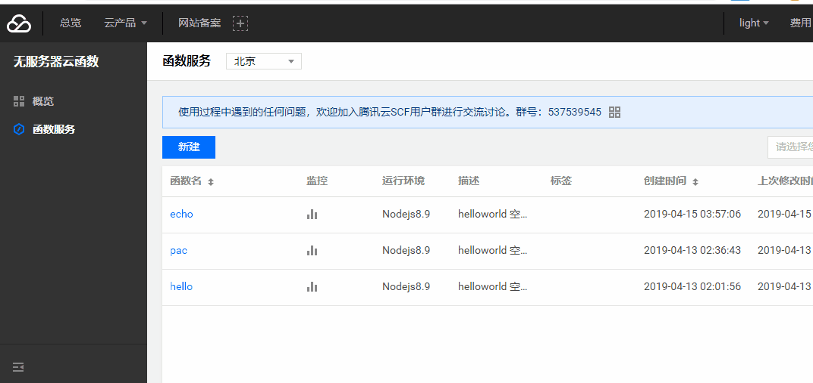

# 国内外云平台功能简介
简单介绍下一些常见的云服务工作方式，可以用来做些什么，运作原理等科普。
# 1 第一阶段 基础服务
## 云主机（VPS）
云平台即云计算服务，早期对于云计算大多数人的概念就是提供云主机或者叫VPS，当然现在使用最多的可能也是这些。这是比较基础的服务，也是DIY成分最多的。就是给你一台Linux服务器，然后给你SSH的账密，你自己想要什么服务，自己去安装、搭建、实现。  
  
VPS一般使用的技术是类似开源框架OpenStack这样的框架，实际分给你的并不是一台完整的机器而是一台虚拟化的机器。至于为什么不直接用实体机器，是因为实体机器的资源没办法分割，而利用OpenStack实际上是将实体机器的所有CPU、内存、文件等资源充分利用，每个用户分得资源可以跨机器，这被OpenStack调度后用户无感。  
  
VPS因为是完整的机器，所以基本可以实现用户的所有需求，例如搭建各种服务器，如网站，FTP等等。也可以用来做测试，写程序，学Linux等等。下图为申请一个vultr平台的vps的流程。

## 存储服务
vps需要用户自己维护，尤其对于数据库等存储类型的服务，用户要自己做好备份，很多个人或者小商户并没有专门的数据库运维，成本太高。所以就有了存储服务，专门针对数据存储的云服务。

常见的存储服务有两种，一种是数据库服务，例如传统的关系型数据库MySQL、PostgreSQL，非关系型数据库MongoDB、Redis，再比如大数据场景下的Hive、Hbase、ES等等。另一种是文件存储服务，例如文件存储、对象存储，例如存储用户头像，用户文件等。  

这类服务会提供一个连接的接入点EndPoint，例如MySQL服务会提供IP、端口、库名、账密，用户通过接入点就可以操作数据库，但是用户没有必要了解数据库运行在哪，云平台保证了数据库稳定运行，并且即使机器坏掉，也有数据备份和热备份的从机，总之一句话，服务稳定运行，用户不用操心（不操心是建立在云平台技术过硬基础上的，之前腾讯云就出现了用户数据丢失被起诉的案例）。  
  

存储服务只限于存储，是专一化的功能服务，下图是利用腾讯云进行对象存储。对象存储和文件存储的区别在于，文件存储是以文件系统（例如NFS、GlusterFS、HDFS）的形式存储，对象存储不是用的这个技术（具体是啥我也不是很了解）。在上传、调用、下载的时候使用的接口不同，应用场景稍有区别。
    

## web服务器
和存储服务一样，web服务也是专一功能的服务，专门提供web服务，一般是通过给用户提供FTP的地址，让用户将网页文件上传到FTP，然后给一个域名，通过这个域名就能访问这些文件。一般服务器还支持PHP语言，用户可以上传相关的后台代码，配合上述的存储服务来使用，可以快速建站。  
   
## cdn和域名服务
web服务器或者vps的带宽有限，且性能有限。可以把很多常用的工具性的文件例如一些通用的js文件放到CDN服务器上，这就是云平台提供的CDN服务。

上述过程中有提到web服务会赠一个域名给用户，但该域名非常长对用户不友好，短小漂亮的域名需要自己买，这就是域名服务啦。在国内域名服务需要备案（写写申请书，拍个自拍），国外就比较自由。具体域名的购买和配置方式这里就不展开了。
# 2 第二阶段 大数据人工智能
## 大数据计算
上文中有提到数据存储，其中说到了大数据的存储形式如ES等，但是数据只存储了，还未能挖掘其中的价值，因而有了计算服务。例如很多平台都提供的MapReduce计算引擎、流式计算引擎等，都是为了大数据场景计算的，针对数据“大”的解决策略。不同平台的计算引擎语法不同，但大都很简单，比原生的Hadoop的接口简单的多，有的甚至直接写SQL即可。MapReduce的一个简单场景如下，可以看出其实是利用多台机器的并行计算来加速整体计算速度的，但是真正的场景更为复杂还要考虑到文件的调度IO等等，选择的Map场景需要大数据工程师自己做抽象和优化。    
  

## 人工智能计算平台
人工智能平台分为两种，一种是需要用户自己设计函数，自己训练模型，调参等，这与大数据的计算平台很像，只不过用到的算法更为高阶，并且在数据处理、模型训练等过程中，可以选择更多的算法，可以灵活调整参数。人工智能计算平台一般使用GPU机器，这些节点价格也较贵，不建议初学者直接用这些平台。

另一种是直接调用接口，进行图像识别、自然语言处理（目前AI落地最好的也就是这两方面）。例如上传图片，可以返回图片内文字的“文字扫描”接口。

# 3 第三阶段 容器、DevOps、Faas
## 容器服务
目前的容器服务我个人认为还不成熟，主要是依托VPS进行容器集群的管理服务提供。因为集群需要多台vps所以费用略高。

用户直接用vps得了，干嘛用容器？这是因为容器的调度是交给云的，在容器异常原因宕机后，调度服务可以立马启动一个容器实例顶替上来，容器还可以根据目前的Qps调整实例数量，例如3个web容器可以应对平时的用户量，但是最近要搞个活动用户数量会翻倍，调度部分就能动态的将web容器实例扩大到6个。容器的调度平台最出名的是Kubernetes，可以参考我的笔记，有多篇对k8s的科普，是非常强大的工具。

容器服务很大程度上替代了运维人员的工作，是自动化运维的里程碑。
## DevOps
dev开发单词的前三个字母，ops运维的简称。这个概念是为了将开发和运维整合起来，敏捷开发。通俗讲就是代码提交，系统自动化进行编译、打包、测试、上线等步骤。

bat还没有较好的DevOps服务，国内，daocloud是最好的代言人，devops服务一般是面向企业的，个人用户感兴趣可以去了解这方面的服务，自己也可以搭建专属的devops平台，串联流程的过程非常有趣，是对个人综合能力的很好的锻炼。
## Faas
到这里基本已经困成狗了，我们简单总结上文中的服务。云计算分为Iaas、Paas、SaaS。三者的区分没有特别绝对，从不同层面我们甚至可以把一个服务归为其中多个形式。Iaas是基础设施即服务，是提供硬件设备的服务形式，例如VPS就是提供了cpu、内存、操作系统等基础设施资源，对用户进行服务的。Paas是平台即服务，上面的大数据计算平台、AI平台都是典型的平台服务。Saas是软件即服务，软件的概念很广，例如CRM（客户关系管理软件）就是一种Saas。

Faas则是近两年提出的概念，AWS的Lambda是最早的Faas服务，函数即服务。函数就是变成语言中的函数，有输入和输出，这是对传统互联网服务的抽象，例如web服务用户请求就是输入，服务端响应 就是输出。Faas通过编写这样的函数，来为用户提供服务，例如写一个web服务用户提交什么就返回什么，就是这样的函数`func echo(a){return a}`。

函数一般是无状态的（每次都会初始化），通过容器运行的，具有按需分配资源的调度方式，可以说Faas充分利用了容器的优点，为用户节约了成本。因为服务的调度全部是后台和容器进行的，用户根本不需要管服务器的运行，甚至不需要知道是不是真的有个服务器运行，只需要知道服务可用就行了，所有的运维问题都不用管了，所以Faas又叫ServerLess（或者说是一种实现）。

以下是腾讯云的ServerLess服务的使用示意。  

函数可以通过多种方式调用，例如我们通过Web的方式调用刚才的函数，并返回web形式的结果，如下。  
  

